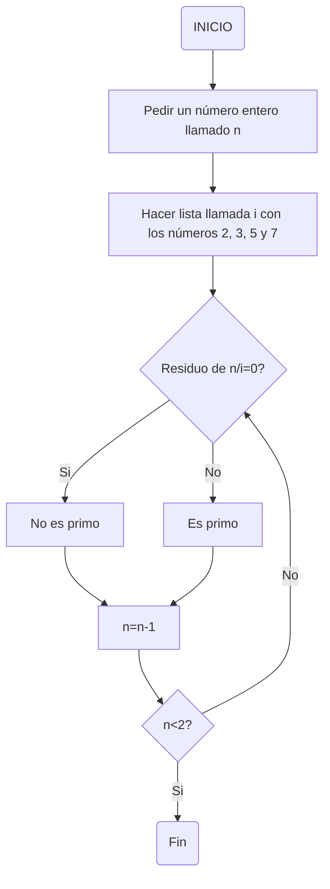

# THE NOOB IN PYTHON 2👽
## DIAGRAMAS DE FLUJO Y PSEUDOCÓDIGO 
+ El siguiente diagrama de flujo es para obtener los números primos hasta un número entero llamado "n":

+ Para el anterior diagrama de flujo se utilizo el pseudocódigo:
```python
inicio
    n : entero # n será un número entero
    i : [2, 3, 5, 7] # hacer una lista llamada i con los números 2, 3, 5 y 7
    Mientras n >= 2 hacer # comenzar una iteración mientras n sea mayor o igual a 2
        Si modulo(n,i) == 0 entonces # si el residuo de la división de n sobre i es 0
            escribir("n no es primo") # el número no es primo ya que tiene más de dos divisores
        sino 
            n es primo # sería primo ya que solo tendría de divisor al número 1 y a el mismo
        n = n - 1 # este mismo procedimiento desde n hasta que el número no sea mayor o igual a 2
    fin mientras
fin
```
